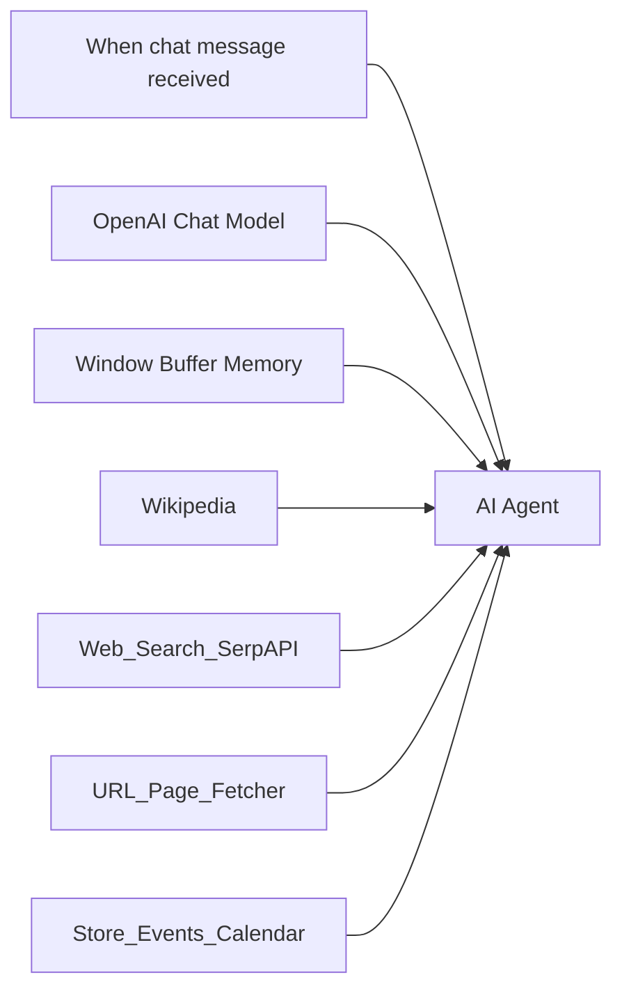

# Bookstore Assistant (n8n AI Agent)

An [n8n](https://n8n.io/) workflow that powers a chat-based AI assistant for an independent bookstore. Customers can ask about books, authors, store events, and shared links; the agent uses tools for search, Wikipedia, page summaries, and Google Calendar.

## Features

| Capability | How it works |
|------------|----------------|
| **Chat interface** | LangChain Chat Trigger starts a session per visitor |
| **Book & author help** | Recommendations and background via OpenAI + Wikipedia + web search |
| **Store events** | Google Calendar tool lists readings, signings, clubs, story times |
| **Current news** | SerpAPI web search for releases, prizes, author news |
| **Link summaries** | HTTP tool fetches readable page text via [Jina Reader](https://jina.ai/reader/) |
| **Conversation memory** | Window buffer memory (last 15 turns) keyed by session ID |

The agent is instructed to match customer tone, use clear formatting, and **not** invent stock levels or prices (no live inventory integration).

## Workflow overview



**Export file:** `Bookstore Assistant (AI Agent).json`

## Prerequisites

- n8n instance (self-hosted or [n8n Cloud](https://n8n.io/cloud/)) with **LangChain / AI Agent** nodes enabled
- Accounts and API keys for:
  - **OpenAI** (model: `gpt-4o-mini`, temperature `0.35`)
  - **SerpAPI** (Google search)
  - **Google Calendar** (OAuth2) for your store events calendar
- Optional: no API key for Wikipedia or Jina Reader URL fetcher (public endpoints)

## Import the workflow

1. Open n8n → **Workflows** → **Import from File**.
2. Select `Bookstore Assistant (AI Agent).json`.
3. After import, open each node that shows a credential warning and attach your own credentials (see below).
4. On **Store_Events_Calendar**, choose the Google Calendar that holds your store events (replace the placeholder calendar in the node).
5. **Activate** the workflow when credentials are configured.

Imported credential names in the JSON are placeholders from the original export; you must map them to your n8n credentials.

## Credentials to configure

| Node | Credential type | Purpose |
|------|-----------------|--------|
| OpenAI Chat Model | OpenAI API | LLM for the agent |
| Web_Search_SerpAPI | SerpAPI | Real-time web search |
| Store_Events_Calendar | Google Calendar OAuth2 | List/filter store events |

Wikipedia and **URL_Page_Fetcher** do not require credentials in this workflow.

## Configuration notes

### Google Calendar (`Store_Events_Calendar`)

- Operation: **Get Many** events from your chosen calendar.
- The agent can pass optional filters: `after`, `before` (ISO datetimes), and `query` (text filter).
- Ensure event titles/descriptions in Calendar are customer-friendly (e.g. “Author signing – Jane Doe”).

### URL page fetcher (`URL_Page_Fetcher`)

- Requests: `https://r.jina.ai/{target_url}` where `target_url` is the full page URL the user or agent supplies.
- Used when users share review links, retailer pages, or articles.

### Memory

- **Session key:** `sessionId` from the chat trigger.
- **Context window:** 15 messages.

### Chat trigger

- With the workflow **active**, use n8n’s built-in chat UI or embed the chat webhook URL where your site/app expects it (see n8n docs for your Chat Trigger version).

## Testing locally

1. Import and wire credentials.
2. Activate the workflow.
3. Open the workflow’s **Chat** panel (or test URL from the Chat Trigger node).
4. Try prompts such as:
   - “What events do you have this month?”
   - “Recommend cozy mysteries like Agatha Christie.”
   - “Summarize this review: https://example.com/book-review”
   - “Who is the author of *Project Hail Mary*?”

## Limitations

- **No inventory API** — the agent must not claim stock; it should suggest staff check or ordering.
- **Pricing/discounts** — only state what the user or tools explicitly provide.
- **Third-party costs** — OpenAI and SerpAPI usage depends on your plans and chat volume.
- **Calendar privacy** — use a dedicated store-events calendar, not a personal calendar with private entries.

## Project structure

```
Bookstore asssistance/
├── README.md
└── Bookstore Assistant (AI Agent).json   # n8n workflow export
```

## License

Add your license here if you plan to share or open-source this workflow.
